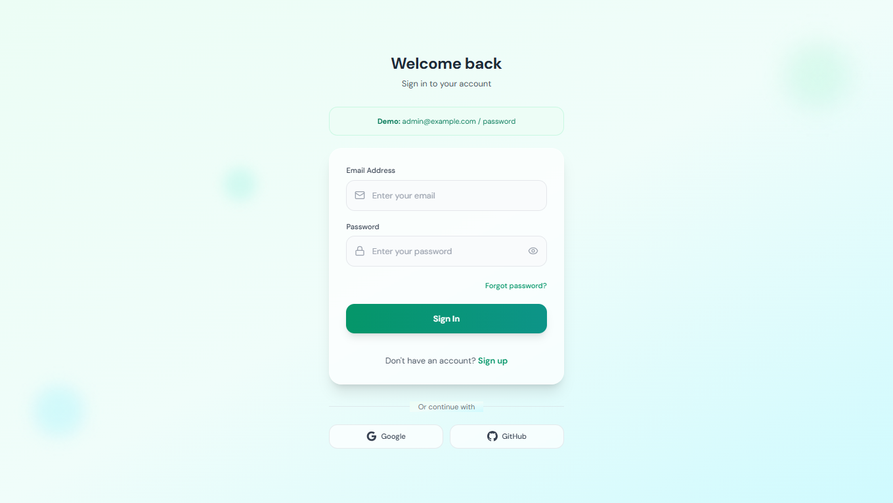
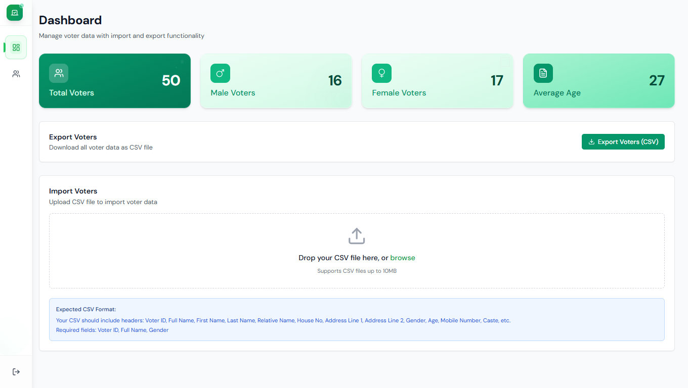
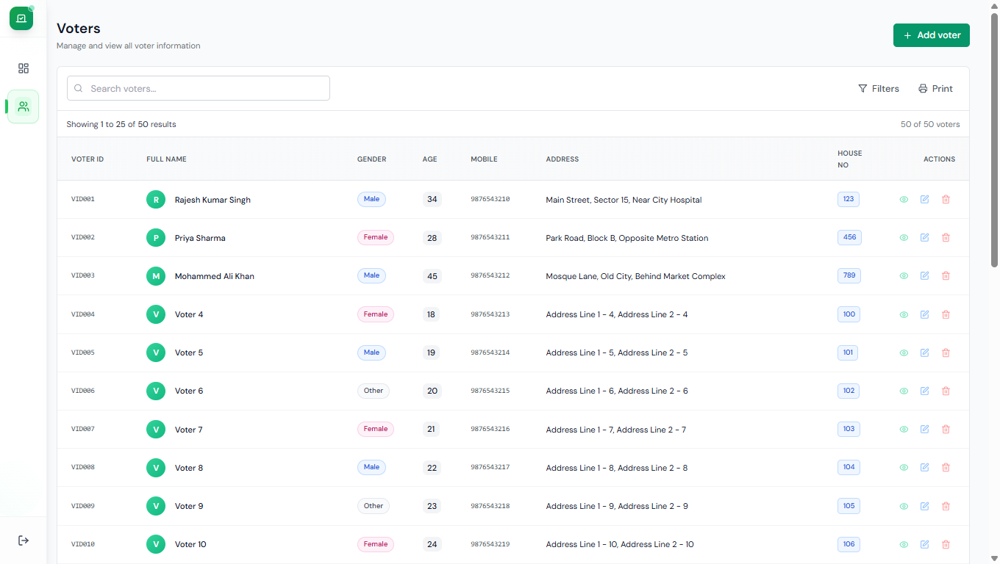

# 🗳️ Voter-DB

A clean, modern, and responsive **Voter Management System** built with **React**, **Tailwind CSS**, and CSV support for importing/exporting voter data. Ideal for election agents, local authorities, or survey teams managing large sets of voter information.

[🌐 Live Demo](https://voter-db.vercel.app)

---

## ✨ Features

- 🔐 **User Authentication** — Secure Sign In / Sign Up
- 📥 **CSV Import** — Drag and drop or browse voter CSV files
- 📤 **CSV Export** — One-click export of all voter data
- 📊 **Dashboard** — Quick stats: Total Voters, Gender Breakdown, Average Age
- 🔎 **Search, Filter, Print** — Easy access to data
- 🧾 **Voter Form** — Full-fledged form to add/update voter details
- 🧹 Clean UI & Responsive Design

---

## 🖼️ Screenshots

### 🔑 Login


### 📝 Register


### 📊 Dashboard


### 📋 Voter List


### ➕ Add New Voter


---
## 📂 CSV Format for Importing

Ensure your CSV includes the following headers: Voter ID, Full Name, First Name, Last Name, Relative Name, House No, Address Line 1, Address Line 2, Gender, Age, Mobile Number, Caste, etc.


---

## 🚀 Getting Started

Follow these steps to run the project locally:

1. **Clone the repository**
   ```bash
   git clone https://github.com/deepjaindrj/Voter-DB.git
   cd Voter-DB
2. **Install dependencies**
   ```bash
   npm install
3. **Start the development server**
  ```bash
  npm run dev
4.**Open your browser at:** http://localhost:5173

## ⚙️ Tech Stack
Frontend: React, Tailwind CSS
Auth: Email/Password + Google & GitHub OAuth
File Support: CSV parsing for import/export
Deployment: Vercel

## 🗂️ Project Structure
Voter-DB/
├── public/
├── src/
│   ├── components/        # Reusable UI components
│   ├── pages/             # Main page components (Login, Register, Dashboard, etc.)
│   ├── services/          # Logic for API/CSV/Auth
│   └── utils/             # Helper functions
├── screenshots/           # Screenshots for README
├── .env                   # Environment variables (if needed)
├── package.json
└── README.md

## Author
**Deep Jain**
